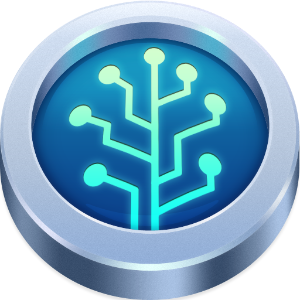

- title : Git Intro
- description : Introduction to Git SCM
- author : Mark Broadhurst
- theme : night
- transition : default

***

### Git

Git is a free and open source distributed version control system designed to handle everything from small to very large projects with speed and efficiency.
Git is easy to learn and has a tiny footprint with lightning fast performance.

***

### Compare SVN to Git

So why Git when we have SVN

' Git is decentralised so works when disconnected
' Git allows a number of developers to work together and merge changes without branching
' Git has GitHub which shows more information about work completed and provides additional features

***

### Creating a Git Repositry

    git init

' Creates a new empty git repository
' Does not add existing files from the directory

***

### Importing a git Repositry

    git clone <url>
    git clone <url> <directory>

' Gets the source code from a remote
' Sets up the clone source as a remote
' Copies a git database locally

***

### Staging changes

    git add <filename or path>
    git add .
    git rm <filename or path>
    git mv <filename or path> <filename or path>

' Stages files but does not commit the files
' Allows you to review your changes before commiting them     

***

### Viewing changes

    git diff
    git status

' Git diff shows changes in files
' Git status shows a list of modified files

***

### Viewing History

    git log
    git log --oneline --decorate --graph

' Git Log shows history of commits in a list
' formatting options and how to show a decent list
***

### Unstaging changes

    git reset
    git reset --hard

    git checkout <filename>    
***

### Commiting locally

    git commit
    git c
    git c -am "Message"
***    

### Creating Branches

    git branch
    git branch <name>
    git branch -d <name>
    git branch -D <name>

***

### Changing branches

    git checkout <branch name>
    git checkout <filename>
    git checkout <sha1>
    git co

***

### Creating a tag

    git tag
    git tag <name>

***

### Adding a remote

    git remote add origin git@github.com:chambersandpartners/example.git
    git remote
    git remote show
    git remote prune

***

### Getting changes from a remote

    git fetch
    git fetch --tags

***

### Applying changes from a remote

    git pull

***

### Sending changes to a remote

    git push
    git push -u origin master

***

### Merging changes

    git merge
    git mergetool

***

### Cleaner merging

    git rebase
    git rebase -i HEAD~4

***

### ThatOhShitMoment

    git reflog

***

### Git Config

    git config
    git config --global
    git config --system

    git config --global user.name "John Doe"
    git config --global user.email johndoe@example.com

### Example of git config

    git config --global help.autocorrect 1
    git config --global color.ui true
    git config --global core.autocrlf true

***

### Setting up alias's

    git config alias.lg "log --oneline --decorate --graph"

***

### One last thing

    git show

Its a thing?    

***

### Git files folders

.gitignore

.gitconfig

.git-credentials

.ssh

***

### Related tools

Atlassian Source Tree

GitHub Desktop

Axosoft Git Kraken

